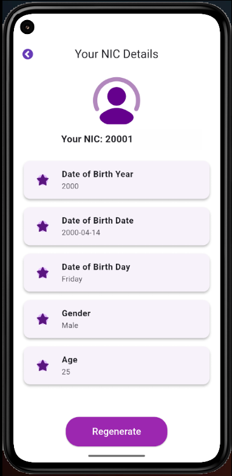

# **NIC Decoder 🇱🇰**  

📌 A **Flutter application** to decode **Sri Lankan National Identity Card (NIC) numbers**, extracting **birth year, birth date, gender, and age**.

---

## **📸 Screenshots**  
| NIC Input Screen | NIC Result Screen |
|-----------------|-----------------|
|  |  |

---

## **✨ Features**  
✅ Decode **Old (9-digit)** and **New (12-digit)** Sri Lankan NIC numbers  
✅ Extract **Date of Birth, Age, Gender, and Day of Birth**  
✅ **Modern UI** with Material Design and GetX state management  
✅ **Validates NIC format** before decoding  

---

## **🚀 Getting Started**  
Follow these steps to set up the project on your local machine.  

### **1️⃣ Prerequisites**  
Ensure you have the following installed:  
🔹 [Flutter SDK](https://flutter.dev/docs/get-started/install)  
🔹 [Dart SDK](https://dart.dev/get-dart)  
🔹 Android Studio / VS Code  

### **2️⃣ Clone the Repository**  
```sh
 git clone https://github.com/raveenjk/NIC_Decoder.git
 cd NIC_Decoder
```

### **3️⃣ Install Dependencies**  
```sh
 flutter pub get
```

### **4️⃣ Run the App**  
```sh
 flutter run
```

---

## **📂 Project Structure**  
```
📂 lib
 ├── 📂 assets             # Icons & images
 ├── 📂 controllers        # GetX controllers
 ├── 📂 screens            # UI screens
 ├── 📂 widgets            # Reusable widgets
 ├── main.dart             # Entry point of the app
```

---

## **🛠 Built With**  
🔹 **Flutter** - Frontend framework  
🔹 **Dart** - Programming language  
🔹 **GetX** - State management  
🔹 **Material UI** - Beautiful UI Components  

---

## **📜 License**  
This project is **open-source** and available under the [MIT License](LICENSE).  

---

## **🌟 Contributing**  
Feel free to **fork** this repository, create a new **branch**, and submit a **pull request**. Contributions are welcome!  

### **📬 Contact**  
💬 If you have any questions, reach out via [GitHub Issues](https://github.com/raveenjk/NIC_Decoder/issues).  

🚀 **Happy Coding!** 🎉

